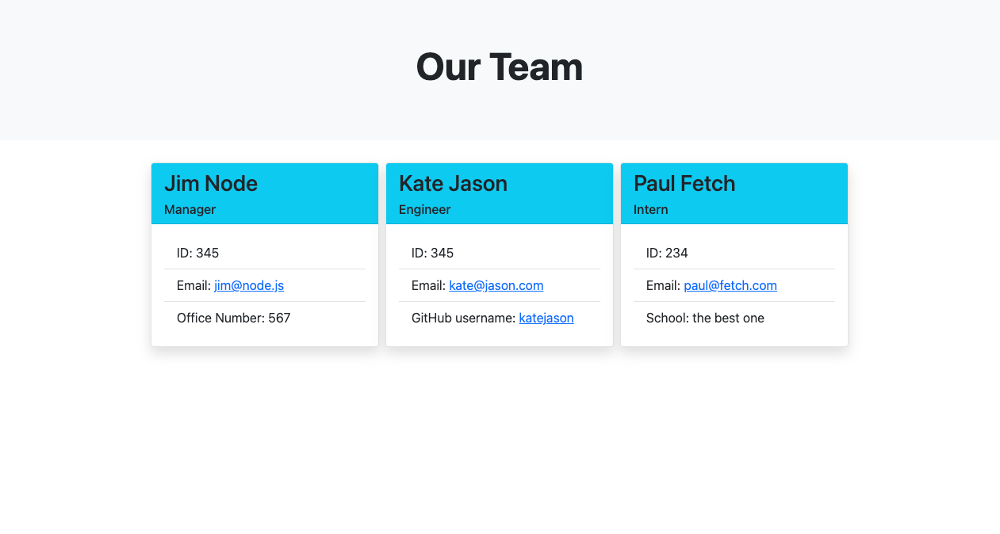
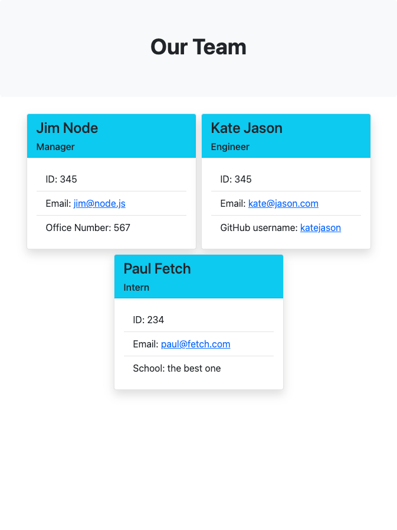
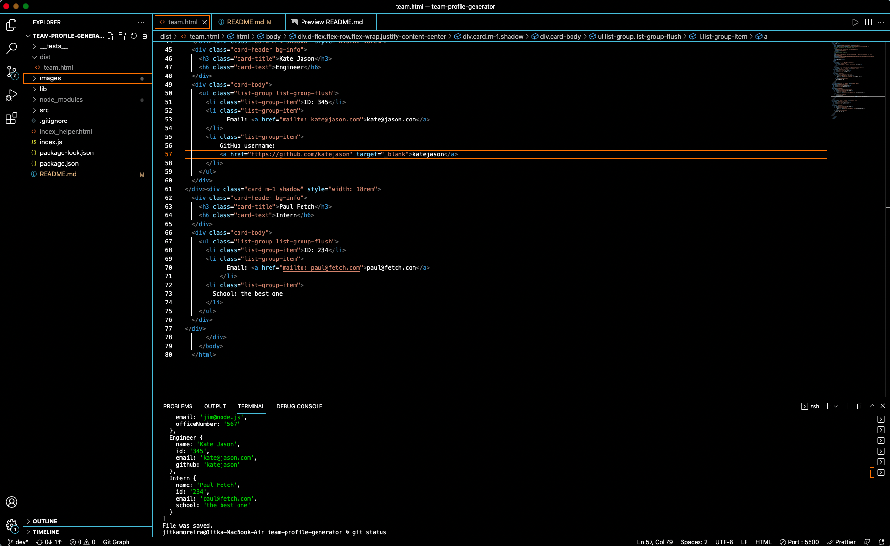

# team-profile-generator

 

## Description

A command-line application that takes in information about team colleagues (user input), then generates an HTML webpage that displays summaries for each person.

## Motivation

The purpose of this app is to practise unit testing for every part of code, and practise working with node.js, npm, inquirer, fs, template literals and more.
 
 
Link to the deployed app: [here](https://jitasek.github.io/team-profile-generator/)
 
Link to the video guide for invoking the app from command line: [here](https://drive.google.com/file/d/1vLpIIPBYK2xNuOXmn9qb6-GwUH_BTb48/view)
 
Link to the video guide for all four tests passing + demo of the generated team.html: [here](https://drive.google.com/file/d/1i0gL29iK7oKwt3SX9paNYDh9JIYQ1tvV/view)

## User Story

As a manager I want to generate a webpage that displays my team's basic info
so that I have quick access to their emails and GitHub profiles.
 
 

## Installation and Usage

Clone this repository to your local environment using the following command in your terminal:

`git clone git@github.com:jitasek/team-profile-generator.git`

Install all the dependencies defined in package.json to your local folder using the following command:

`npm install`

Make sure you are standing in the main (TEAM-PROFILE-GENERATOR) folder where the main index.js file is located and run in the command line:

`node index.js`

You will get prompted for input. After you are done with your last prompt (i.e. you select the option "I don't want to add any more members."), press enter and a new styled team.html file will get generated in /dist folder with all your answers in there.
 
 

## Acceptance Criteria

WHEN I am prompted for my team members and their information, an HTML file is generated that displays a nicely formatted team roster based on user input.

WHEN I click on an email address in the HTML, my default email program opens and populates the TO field of the email with the address.

WHEN I click on the GitHub username, that GitHub profile opens in a new tab.

WHEN I start the application, I am prompted to enter the team manager’s name, employee ID, email address, and office number.

WHEN I enter the team manager’s name, employee ID, email address, and office number, I am presented with a menu with the option to add an engineer or an intern or to finish building my team.

WHEN I select the engineer option, I am prompted to enter the engineer’s name, ID, email, and GitHub username, and I am taken back to the menu.

WHEN I select the intern option, I am prompted to enter the intern’s name, ID, email, and school, and I am taken back to the menu.

WHEN I decide to finish building my team, I exit the application, and the HTML is generated.

## Screenshots

 

